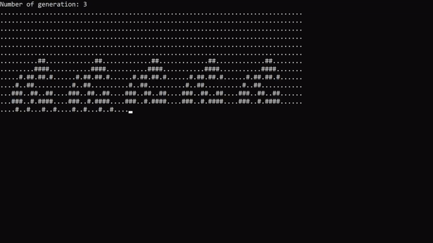

# Game_of_Life
**In this project presents a game according to three rules:**

- Any living cell with two or three neighbors survives.
- Any dead cell with three living neighbors becomes a living cell.
- All other living cells die in the next generation. Similarly, all other dead cells remain dead.

*Example:*

**Desctiptions:**

1. The size of the field is 25 by 80 points.
2. The field is "closed to itself", for example, in the lower right square, the neighbor on the right is the lower left square, and the neighbor on the bottom is the upper right.